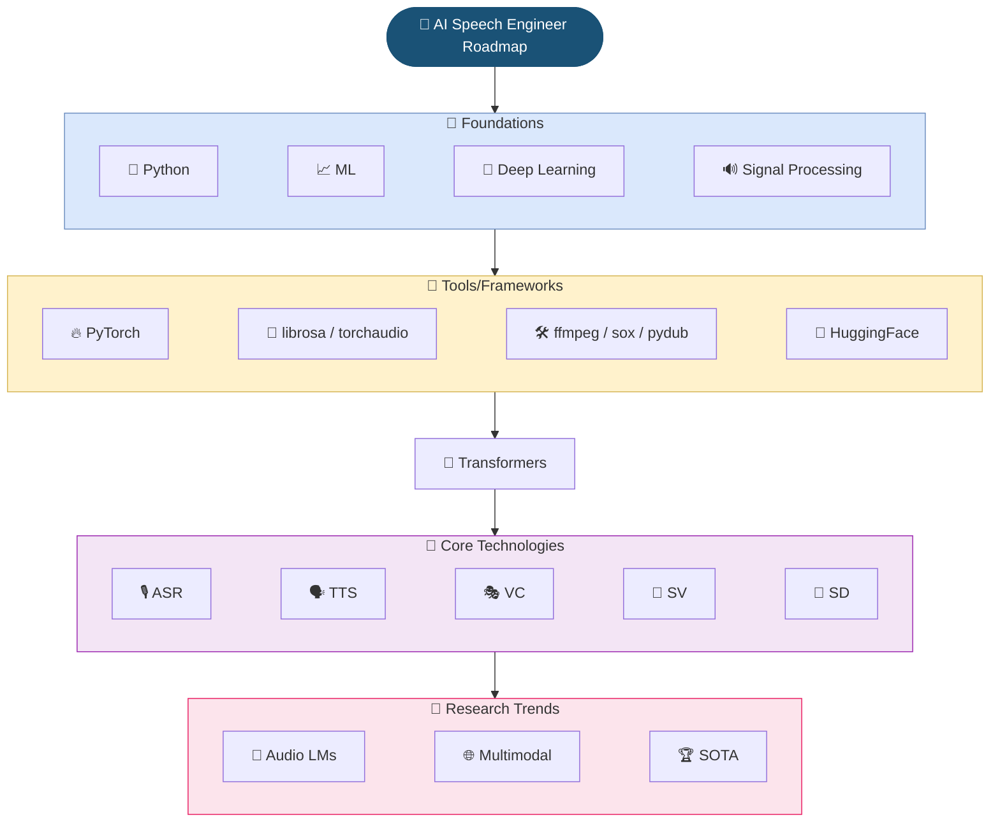

# 🥑 ROADMAP: AI Speech Engineer


> A curated roadmap based on my 6 years of experience form zero to become a skilled AI Speech Engineer. 🚀👨‍💻  
> This roadmap covers everything from fundamentals to cutting-edge research trends in the speech domain.

---

## �️ Roadmap Diagram



---

## �📅 Overview Timeline

| Phase                        | Duration   | Focus Areas                               |
|------------------------------|------------|-------------------------------------------|
| 🧠 Foundations              | 3 months   | Math, Python, Machine Learning, Deep Learning, Signal Processing           |
| 💼 Tools & Frameworks       | 3 months   | Libraries, Audio Tools, Hugging Face      |
| 🌱 Core Technologies        | 12 months  | ASR, TTS, Voice Conversion, Speaker Verification & Diarization |
| 🔬 Research Trends          | Continuous | Audio-Language Models                     |

---

## 🧠 #1 Foundations (3 months)

### 🔹Python Basic
- ⭐ 📺 [Python Tutorial for Beginners](https://www.youtube.com/watch?v=YYXdXT2l-Gg&list=PL-osiE80TeTt2d9bfVyTiXJA-UTHn6WwU)

### 🔹Machine Learning Basic
- ⭐ 📃 [Machine Learning Specialization (Free Course)](https://www.coursera.org/specializations/machine-learning-introduction)

### 🔹Deeplearning Basic
- ⭐ 📺 [1. what is a neural network?](https://www.youtube.com/watch?v=aircAruvnKk)
- ⭐ 📺 [2. Gradient descent, how neural networks learn](https://www.youtube.com/watch?v=IHZwWFHWa-w)
- ⭐ 📺 [3. Backpropagation, intuitively](https://www.youtube.com/watch?v=Ilg3gGewQ5U)
- ⭐ 📺 [4. Backpropagation calculus](https://www.youtube.com/watch?v=tIeHLnjs5U8)

### 🔹Audio Signal Processing for ML
- ⭐ 📺 [Learn all about speech concepts & features](https://www.youtube.com/watch?v=iCwMQJnKk2c&list=PL-wATfeyAMNqIee7cH3q1bh4QJFAaeNv0)

---

## 💼 #2 Tools & Frameworks (3 months)

### 🧰 Frameworks & Libraries
- ⭐ `PyTorch` - Training models framework
- ⭐ `librosa` - Audio preprocessing (STFT, MFCCs, etc.)
- ⭐ `torchaudio`- Audio loading, transforms, and model wrappers
- `ffmpeg`, `sox`, `pydub` - Audio conversion, slicing, format handling
- `noisereduce` – Simple noise reduction from raw audio

### 🖥️ Tools
- [Audacity](https://www.audacityteam.org/) - A free & powerful software for editing & visualizing audio
- [Audacity Tutorial](https://www.youtube.com/watch?v=vlzOb4OLj94)

### 🤗 Hugging Face Course
- ⭐ [Hugging Face Audio](https://huggingface.co/learn/audio-course/en/chapter1/audio_data) - Learn to tackle a range of audio-related tasks and gain experiments with speech datasets.

---

## 🌱 #3 Dive Into Speech Core Technologies (12 months)

### 🤖 Transformers (Attention is all you need)
- ⭐ [Original Paper (2017)](http://arxiv.org/abs/1706.03762)
- ⭐ [Illustrated Transformer Blog](https://jalammar.github.io/illustrated-transformer/)
- [Attention in transformers](https://www.youtube.com/watch?v=eMlx5fFNoYc)

### 🎙️ Automatic Speech Recognition (ASR)
- ⭐ [Sequence Modeling With CTC (2017)](https://distill.pub/2017/ctc/)
- [SpecAugment (2019)](https://blog.research.google/2019/04/specaugment-new-data-augmentation.html)
- ⭐ [Wav2Vec2 (2020)](https://arxiv.org/abs/2005.08100)
- [Generation of large-scale simulated utterances in virtual rooms... (2020)](https://storage.googleapis.com/gweb-research2023-media/pubtools/pdf/509254e34b4c496eb3cfa1c2be1e1b5fc874bee3.pdf)
- [Illustrated Wav2Vec2 (2021)](https://jonathanbgn.com/2021/09/30/illustrated-wav2vec-2.html)
- ⭐ [Whisper (2022)](https://arxiv.org/abs/2212.04356)
- [Fast Conformer (2023)](https://arxiv.org/abs/2305.05084)
- ⭐ [SpeechBrain ASR - Tutorial](https://speechbrain.readthedocs.io/en/latest/tutorials/tasks/speech-recognition-from-scratch.html)
- [VLSP 2025 ASR - Twinkle Team (2025)](materials/asr_vlsp_2025_twinkle_team.pdf)

### 🗣️ Text-to-Speech (TTS)
- [HMM-based Vietnamese TTS (2016)](https://theses.hal.science/tel-01260884/document)
- ⭐ [Wavenet: A Generative Model for Raw Audio (2016)](https://arxiv.org/abs/1609.03499)
- ⭐ [Tacotron: Towards End-to-End Speech Synthesis (2017)](https://arxiv.org/abs/1703.10135)
- [WaveGlow: A Flow-based Generative Network for Speech Synthesis (2018)](https://arxiv.org/abs/1811.00002)
- [FastSpeech 1: Fast, Robust and Controllable Text to Speech (2019)](https://arxiv.org/abs/1905.09263)
- ⭐ [FastSpeech 2: Fast and High-Quality End-to-End Text to Speech (2020)](https://arxiv.org/abs/2006.04558)
- ⭐ [HiFi-GAN: Generative Adversarial Networks for Efficient and High Fidelity Speech Synthesis (2020)](https://arxiv.org/abs/2010.05646)
- ⭐ [VITS: Conditional Variational Autoencoder with Adversarial Learning for End-to-End Text-to-Speech (2021)](https://arxiv.org/abs/2106.06103)
- [My graduation thesis (Vietnamese) (2021)](materials/graduation-thesis.pdf)
- [JETS: Jointly Training FastSpeech2 and HiFi-GAN for End to End Text to Speech (2022)](https://arxiv.org/abs/2203.16852)
- [NaturalSpeech: End-to-End Text to Speech Synthesis with Human-Level Quality (2022)](https://arxiv.org/abs/2205.04421)
- [Kokoro TTS: A cutting-edge model with 82M parameters, built on StyleTTS 2 architecture... (2024)](https://kokorottsai.com/)

#### 🇻🇳 Vietnamese Resources
- [Viphoneme](https://github.com/v-nhandt21/Viphoneme)
- [Text2PhonemeSequence](https://github.com/thelinhbkhn2014/Text2PhonemeSequence)
- [VLSP 2021 TTS - Navi Team (2021)](materials/vlsp_tts_2021_navi_team.pdf)
### 🔐 Speaker Verification (SV)
- ⭐ [Speech Verification Introduction](https://maelfabien.github.io/machinelearning/Speech1/#)
- ⭐ [X-vector Paper (2017)](https://danielpovey.com/files/2017_interspeech_embeddings.pdf)
- [I-vector Paper (2018)](https://www.sciencedirect.com/science/article/pii/S1877050918314042/pdf)
- ⭐ [VoxCeleb: a large-scale speaker identification dataset (2018)](https://arxiv.org/abs/1706.08612)
- ⭐ [ECAPA-TDNN: Emphasized Channel Attention, Propagation and Aggregation... (2020)](https://arxiv.org/abs/2005.07143)
- [ResNeXt and Res2Net Structures for Speaker Verification (2020)](https://arxiv.org/abs/2007.02480)
- [CAM++: A Fast and Efficient Network for Speaker Verification Using Context-Aware Masking (2023)](https://arxiv.org/abs/2303.00332)
- [3D-Speaker: A Large-Scale Multi-Device, Multi-Distance, and Multi-Dialect Corpus... (2023)](https://arxiv.org/abs/2306.15354)
- [ERes2NetV2: Boosting Short-Duration Speaker... (2024)](https://arxiv.org/html/2406.02167v1)
- [Golden Gemini is All You Need: Finding the Sweet Spots for Speaker Verification (2024)](https://arxiv.org/abs/2312.03620)
- [RedimNet: Reshape Dimensions Network for Speaker Recognition (2024)](https://arxiv.org/abs/2407.18223)

### 👥 Speaker Diarization (SD)
- ⭐ [Speaker Diarization: An Introductory Overview (2023)](https://lajavaness.medium.com/speaker-diarization-an-introductory-overview-c070a3bfea70)
- ⭐ [pyannote.audio: neural building blocks for speaker diarization (2019)](https://arxiv.org/abs/1911.01255)
- ⭐ [A Review of Speaker Diarization: Recent Advances with Deep Learning (2021)](https://arxiv.org/abs/2101.09624)
- [Multi-scale Speaker Diarization with Dynamic Scale Weighting (2022)](https://arxiv.org/pdf/2203.15974)
- [Comparing state-of-the-art speaker diarization frameworks: Pyannote vs Nemo (2023)](https://lajavaness.medium.com/comparing-state-of-the-art-speaker-diarization-frameworks-pyannote-vs-nemo-31a191c6300)
- [DiarizationLM: Speaker Diarization Post-Processing with Large Language Models (2024)](https://arxiv.org/html/2401.03506v10)
- [Sortformer: Seamless Integration of Speaker Diarization and ASR... (2024)](https://arxiv.org/abs/2409.06656)
- [Speaker Diarization: From Traditional Methods to the Modern Models (2025)](https://leminhnguyen.github.io/post/speech-research/speaker-diarization/)
- [(SOTA) Streaming Sortformer: Speaker Cache-Based Online... (2025)](https://arxiv.org/abs/2507.18446)

### 🎭 Voice Conversion (VC)
- ⭐ [AutoVC: Zero-Shot Voice Style Transfer with Only Autoencoder Loss (2019)](https://arxiv.org/abs/1905.05879)
- ⭐ [An Overview of Voice Conversion and its Challenges: From Statistical Modeling to Deep Learning (2020)](https://arxiv.org/abs/2008.03648)
- [AGAIN-VC: A One-shot Voice Conversion using Activation Guidance and Adaptive Instance Normalization (2021)](https://arxiv.org/abs/2011.00316)
- [YourTTS: Towards Zero-Shot Multi-Speaker TTS and Zero-Shot Voice Conversion (2022)](https://arxiv.org/abs/2112.02418)
- [kNN-VC: Voice Conversion With Just Nearest Neighbors (2023)](https://arxiv.org/abs/2305.18975)
- ⭐ [Seed-VC: Towards Robust Zero-shot Voice Conversion and Singing Voice Conversion (2024)](https://arxiv.org/abs/2411.09943)
- [VLSP 2025 Voice Conversion - Twinkle Team (2025)](materials/vc_vlsp_2025_twinkle_team.pdf)

---

## 🔬 #4 Research Trends

### 🤯 Audio Language Models
- ⭐ [Qwen-Audio: Advancing Universal Audio Understanding via Unified Large-Scale... (2023)](https://arxiv.org/abs/2311.07919)
- [MiniCPM: Unveiling the Potential of Small Language Models with Scalable... (2024)](https://arxiv.org/abs/2404.06395)
- ⭐ [CosyVoice: A Scalable Multilingual Zero-shot Text to Speech... (2024)](https://arxiv.org/abs/2407.05407)
- [FunAudioLLM: Voice Understanding and Generation Foundation Models... (2024)](https://arxiv.org/html/2407.04051v1)
- ⭐ [F5-TTS: A Fairytaler that Fakes Fluent and Faithful Speech with Flow Matching (2024)](https://arxiv.org/abs/2410.06885)
- ⭐ [Recent Advances in Speech Language Models: A Survey (2024)](https://arxiv.org/pdf/2410.03751)
- [Audio-Language Models for Audio-Centric Tasks: A survey (2025)](https://arxiv.org/pdf/2501.15177)
- [On The Landscape of Spoken Language Models: A Comprehensive Survey (2025)](https://arxiv.org/abs/2504.08528)
- [CosyVoice 3: Towards In-the-wild Speech Generation via Scaling-up and Post-training... (2025)](https://arxiv.org/abs/2505.17589)
- [(SOTA) Qwen3-ASR: Supported 52 Languages Automatic Speech Recognition... (2026)](https://arxiv.org/abs/2512.03336)
- [Qwen3-TTS: Multilingual, Streaming Text to Speech with Voice Cloning... (2026)](https://arxiv.org/abs/2601.15621)

---

## 📄 License

This project is licensed under the [MIT License](LICENSE).

```
MIT License

Copyright (c) 2026 Le Minh Nguyen
```
