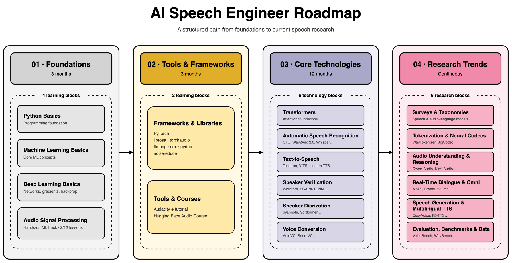

# 🐌 AI Speech Engineer Roadmap

> A curated learning path for becoming an AI Speech Engineer, from fundamentals to current research.

The roadmap is the primary product. Its detailed phases, papers, tools, and hands-on tutorial tracks live in [ROADMAP.md](ROADMAP.md).

## Roadmap at a glance

## Highlights

| Focus | What to explore |
| --- | --- |
| Foundations | Python, ML, deep learning, and audio signal processing. |
| Build track | [2 of 12 DSP tutorial lessons](ROADMAP.md#audio-signal-processing-for-ml) are available now. |
| Core speech | ASR, TTS, speaker verification, diarization, and voice conversion. |
| Current research | Audio-language models, speech codecs, realtime dialogue, and evaluation benchmarks. |
