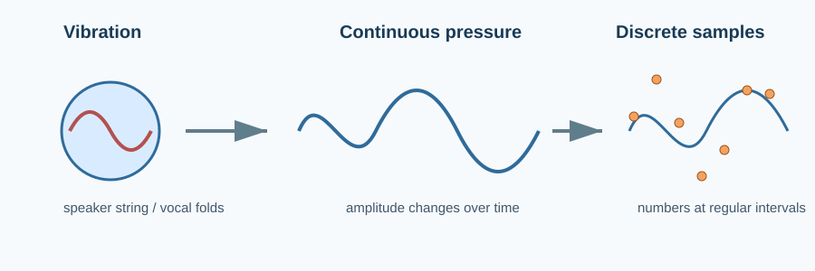
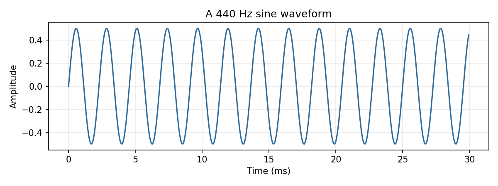
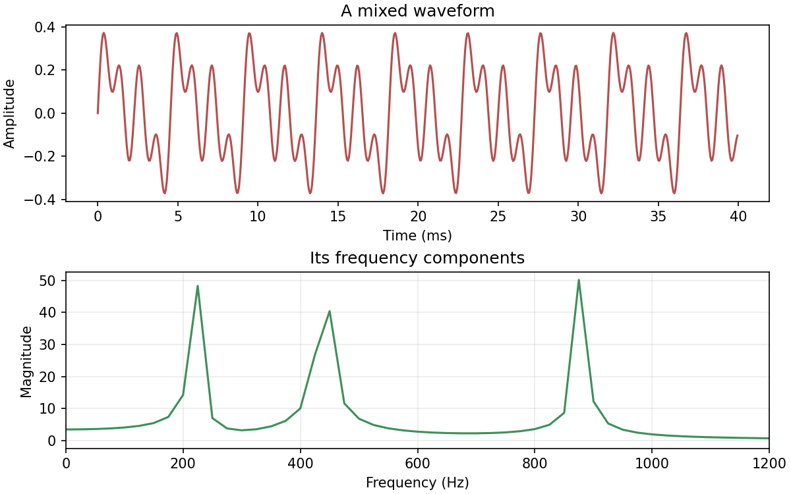

# Sound and Waveforms

> Before an audio model sees a tensor, a microphone has already turned motion into a sequence of numbers.

**Type:** Learn + Build  
**Language:** Python  
**Prerequisites:** Basic Python and NumPy arrays  
**Time:** ~45 minutes

## Learning Objectives

- Describe amplitude, frequency, period, and phase in a waveform.
- Generate a sinusoid from its mathematical definition.
- Mix simple tones without clipping.
- Connect a waveform to its frequency components.
- Save and load a mono PCM16 WAV file.

## The Problem

Speech, music, and noise look very different to us, but a computer receives all of them as a one-dimensional sequence. If the sequence has no meaning in your head, later ideas such as spectrograms and mel features feel like magic.



A waveform records a quantity that changes with time. For sound, it is usually air-pressure deviation; after a microphone and analog-to-digital converter, it is a normalized floating-point array. A 1-second mono recording at 16 kHz contains 16,000 samples.

## The Mental Model

For a pure tone, the sample value at time $t$ is:

$$x(t) = A\sin(2\pi ft + \phi)$$

`A` is amplitude, `f` is frequency in hertz, and `φ` is phase in radians. Frequency says how often the pattern repeats; amplitude says how far it moves from zero. Real speech is not a single sine wave, but a mixture whose ingredients change over time.



## Build It with NumPy

`code/main.py` creates the time axis with `np.arange`, applies the equation above, averages equal-length tones into a mix, and uses Python's built-in `wave` module for a PCM16 WAV round trip.

```python
def sine_wave(frequency_hz, sample_rate, seconds, amplitude=0.5):
    t = np.arange(round(sample_rate * seconds), dtype=np.float64) / sample_rate
    return amplitude * np.sin(2.0 * np.pi * frequency_hz * t)
```

Run it from the lesson directory:

```bash
python3 code/main.py
python3 code/generate_figures.py --output-dir assets/generated
```

The second command is the source of the committed plots, so figures can be regenerated rather than edited by hand.



## Validate the Idea

At 8,000 Hz, a 0.25-second 500 Hz tone has exactly 2,000 samples and 125 cycles. Its FFT peak is therefore exactly 500 Hz. The unit tests check this known case, waveform range, mixing, and PCM16 round-trip error.

## Use It in Practice

For a production loader, use `soundfile` or `librosa` instead of the intentionally narrow PCM16 reader:

```python
import soundfile as sf

samples, sample_rate = sf.read("recording.wav", dtype="float32", always_2d=False)
```

The lesson implementation stays small so that format conversion does not hide the waveform concepts. Later lessons will use `librosa` for feature extraction and compare it with the NumPy implementation.

## Pitfalls

- A waveform's shape is not a picture of the words being spoken; it is instantaneous pressure over time.
- Summing tones can exceed `[-1, 1]` and clip when written as PCM. Average or normalize first.
- Frequency needs a time scale. A repeating pattern without its sample rate has no frequency in hertz.
- PCM16 is quantized, so a round trip is close to—not exactly—the original float signal.

## Exercises

1. Generate A3 (220 Hz), A4 (440 Hz), and A5 (880 Hz); verify the frequency peaks.
2. Change phase by `π/2`. What changes in the waveform, and what does not change in the magnitude spectrum?
3. Make a one-second major chord, write it to WAV, then explain why averaging avoids clipping but reduces loudness.

## Key Terms

| Term | Meaning |
| --- | --- |
| Waveform | A value measured at successive moments in time. |
| Amplitude | Distance from zero; related to signal level. |
| Frequency | Repetitions per second, measured in hertz. |
| Phase | Where a periodic pattern starts within its cycle. |
| PCM16 | Signed 16-bit integer representation used by many WAV files. |

## Further Reading

- [The Scientist and Engineer's Guide to DSP: Sound](https://www.dspguide.com/ch22.htm)
- [NumPy: Discrete Fourier Transform](https://numpy.org/doc/stable/reference/routines.fft.html)
- [Python `wave` module](https://docs.python.org/3/library/wave.html)
