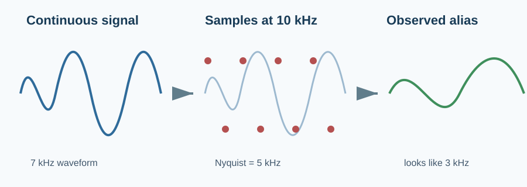
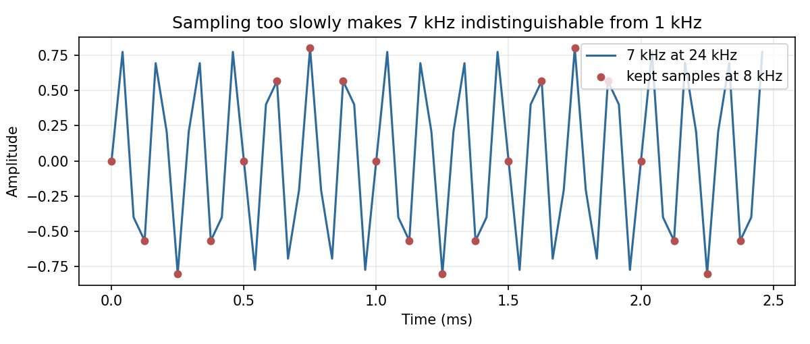
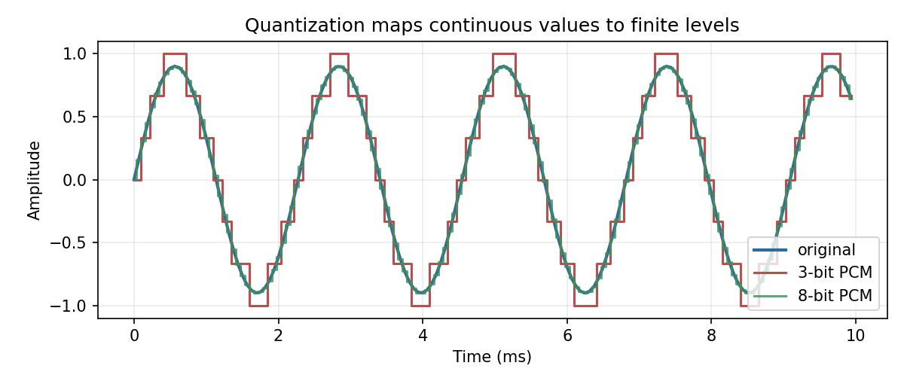

# Digital Audio: Sampling, Aliasing, and Quantization

> A digital recording is not continuous sound captured perfectly; it is a carefully chosen set of measurements.

**Type:** Learn + Build  
**Language:** Python  
**Prerequisites:** [Sound and Waveforms](../../01-sound-and-waveforms/docs/en.md)  
**Time:** ~50 minutes

## Learning Objectives

- Explain sample rate, Nyquist frequency, and bit depth.
- Predict the alias produced by a tone above Nyquist.
- Demonstrate why naive downsampling corrupts high frequencies.
- Quantize normalized samples to signed PCM levels.
- Use a resampling library safely in practical code.

## The Problem

An audio tensor is only meaningful together with its sample rate. The same sequence can represent a short high-pitched sound at 48 kHz or a lower-pitched sound at 16 kHz. Mismatching this metadata is a common silent failure in ASR and TTS pipelines.



The Nyquist frequency is half the sample rate. A 16 kHz recording can represent frequencies up to 8 kHz. Energy above that limit folds back into the audible range as an *alias*; it does not simply disappear.

## Sampling and Aliasing

For a sample rate `sr`, `f` and `sr - f` produce the same sampled values when `f` is above Nyquist. Thus, a 7 kHz tone at 10 kHz is observed as 3 kHz:

$$f_{alias}=|((f+sr/2)\bmod sr)-sr/2|$$



This is why a proper resampler applies a low-pass filter *before* discarding samples.

## Quantization

Each sample must also fit a finite number of levels. Signed PCM with `b` bits has a positive maximum of $2^{b-1}-1$. Quantization rounds a normalized float to the nearest level; converting it back leaves a small error called quantization noise.



## Build It with NumPy

`code/main.py` implements the Nyquist calculation, frequency folding, a real FFT validation, naive decimation, and integer PCM quantization.

```python
def quantize_pcm(samples, bits=16):
    max_integer = 2 ** (bits - 1) - 1
    return np.rint(np.clip(samples, -1.0, 1.0) * max_integer).astype(np.int64)
```

Run it from this lesson directory:

```bash
python3 code/main.py
python3 code/generate_figures.py --output-dir assets/generated
```

The expected alias checks are covered by unit tests: 7 kHz at 10 kHz becomes 3 kHz; 7 kHz sampled at 24 kHz and naively reduced to 8 kHz becomes 1 kHz.

## Use It in Practice

Do not implement production resampling by slicing arrays. `librosa` includes filtering:

```python
import librosa

resampled = librosa.resample(samples, orig_sr=48_000, target_sr=16_000)
```

For a speech model, make sample-rate conversion an explicit pipeline step and log the final shape, sample rate, channels, and dtype. Match the model's expected rate before calculating mel features.

## Pitfalls

- Downsampling means filtering and then reducing the rate; `samples[::3]` is only a demonstration of the bug.
- More sample rate does not automatically improve a model trained at 16 kHz; model and input must agree.
- Bit depth controls level resolution, while sample rate controls the highest representable frequency.
- Stereo shape is usually `(channels, samples)` or `(samples, channels)` depending on the library. Verify it before selecting a channel or averaging to mono.

## Exercises

1. Predict and verify the aliases of 6 kHz, 9 kHz, and 14 kHz at a 10 kHz sample rate.
2. Compare the maximum quantization error for 3-bit, 8-bit, and 16-bit PCM.
3. Record or obtain a WAV, resample it from its original rate to 16 kHz using `librosa.resample`, and explain what bandwidth is removed.

## Key Terms

| Term | Meaning |
| --- | --- |
| Sample rate | Number of measurements per second. |
| Nyquist frequency | Half the sample rate; the highest unambiguous frequency. |
| Aliasing | High-frequency content folding into a false lower frequency. |
| Quantization | Mapping continuous sample values to finite numerical levels. |
| Bit depth | Number of bits available to represent each quantized sample. |

## Further Reading

- [The Scientist and Engineer's Guide to DSP: Sampling Theorem](https://www.dspguide.com/ch3.htm)
- [librosa resample API](https://librosa.org/doc/latest/generated/librosa.resample.html)
- [NumPy `rfft`](https://numpy.org/doc/stable/reference/generated/numpy.fft.rfft.html)
